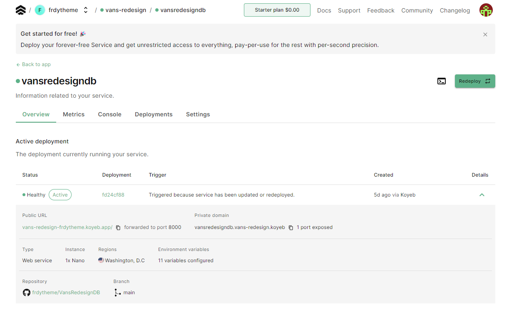
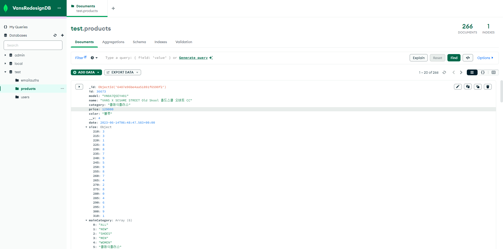
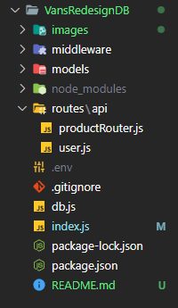
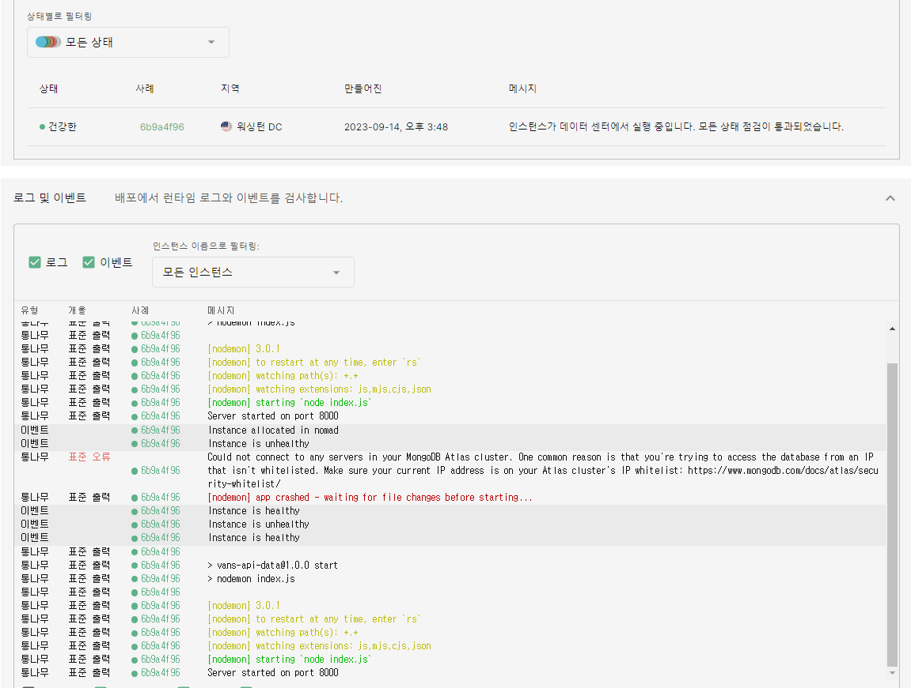
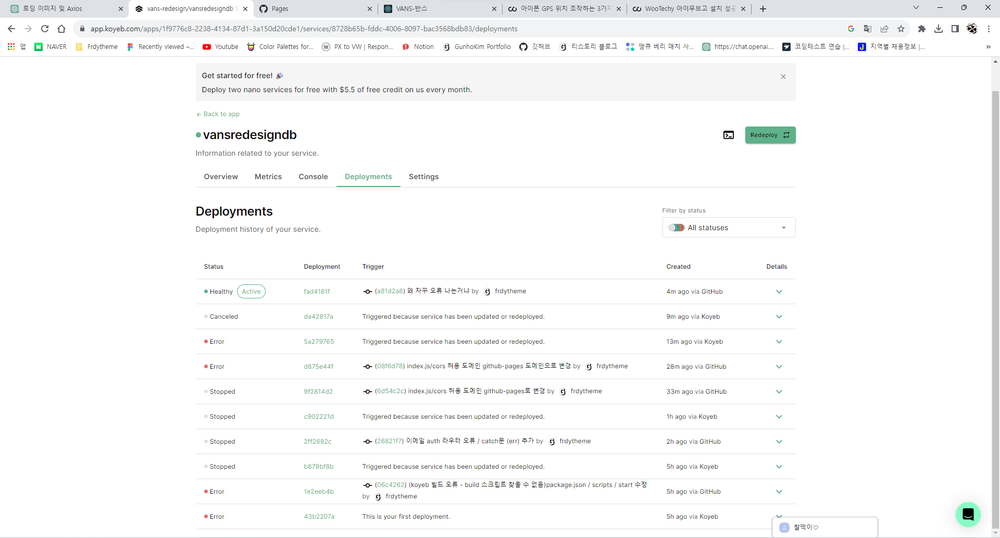
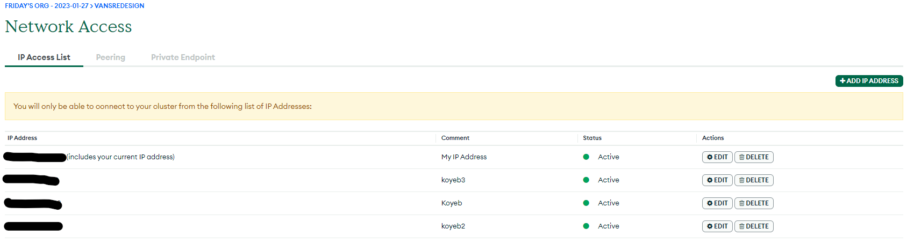
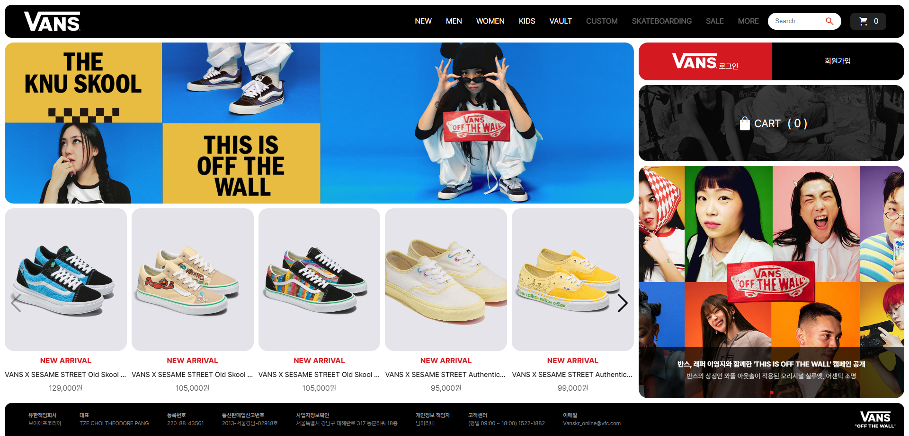

## 반스 리디자인 프로젝트 데이터베이스 구축


##### 작업 기간 : 2023.5.25 ~ 2023 9.25 (4 Month)

##### 작업 유형 : 개인 프로젝트 (기여도 - 100%)

#### - 사용 기술     

---

### 1. 이 프로젝트를 통해 얻고자 하는 게 무엇인가?

- 국비 교육 당시 mongoDB와 mongoose를 배웠었는데 제대로 프로젝트에 적용해 본 적이 없어서 제품 정보와 유저 정보를 담은 DB를 구현해보고 싶었다.
  <br>
- 프론트엔드에서 받은 CRUD요청이 백엔드에서 어떻게 처리하고 다시 클라이언트에게 보내는 지 직접 코드를 짜며 확인해보고 싶었다.

---

*koyeb에 배포된 DB 서버*



---

*유저 정보와 제품 정보를 담은 MongoDB 데이터베이스*



---

### 2. 프로젝트를 하며 느낀 점

- 프론트엔드로 로그인 기능을 구현할 때 단순히 텍스트가 맞는지만 체크해보다가 서버에 전송된 중요 데이터를 암호화해서 반환하고 받은 데이터를 해석해서 검증하고 결과를 반환하는 작업을 해보면서 보안의 중요성과 클라이언트와 서버가 동작하는 방식을 조금은 이해할 수 있었다.
<br>
- 클라이언트가 서버로부터 받은 데이터를 보관하는 방식에 대해 공부할 수 있었다. 특히 토큰 검증 로그인 기능을 구현하면서 쿠키 전송을 처음 작업해보면서 클라이언트가 데이터를 저장하는 (세션 스토리지, 로컬 스토리지, 쿠키) 방식의 장단점을 공부할 수 있었다
<br>
- 데이터베이스 서버를 구축해보는 건 처음이었는데, 그냥 정보를 정리해서 담아뒀다가 전달만 하는 게 아니라 클라이언트가 보낸 요청에 따라 정보를 선별하고 가공해서 보낼 수 있고, 유저가 맞는 지 검증하는 것도 서버에서 처리하는 걸 배웠다.

---

### 3. 디렉토리 구조



---

### 4. 주요 기능

#### - 유저 로그인 검증 & jwt토큰 발급 & 장바구니 동기화

*로그인 시 액세스 토큰과 리프레쉬 토큰이 발급되며 액세스 토큰 만료 시 리프레쉬 토큰을 통해 재발급<br>클라이언트 측에서 리프레쉬 토큰의 유무를 통해 자동 로그인 기능 추가*

```jsx
router.post("/login", async (req, res) => {
  const { name, password, cart } = req.body;
  try {
    // user_id가 존재하는 지 확인
    let user = await User.findOne({ name });
    // 일치하는 ID가 없으면 라우터 종료 => 에러 출력
    if (!user)
      return res.status(500).send({ message: "아이디가 존재하지 않습니다." });

    // bcrypt를 사용해서 입력된 패스워드와 암호화 패스워드 검증.
    const isPasswordCheck = await bcrypt.compare(password, user.password);

    if (!isPasswordCheck)
      return res.status(500).send({ message: "패스워드가 일치하지 않습니다." });

    // 패스워드와 아이디 모두 일치할 시 jwt토큰 발행

    // json web token 으로 변환할 데이터 정보
    const payload = {
      user: {
        id: user.id,
      },
    };

    // jwt토큰 생성
    const accessToken = jwt.sign(payload, process.env.JWT_SECRET, {
      expiresIn: "15m",
    });

    res.cookie("access_token", accessToken, {
      httpOnly: true,
      sameSite: "none",
      path: "/",
      secure: true,
      maxAge: 15 * 60 * 1000,
    });

    const refreshToken = jwt.sign(payload, process.env.JWT_SECRET_REFRESH, {
      expiresIn: "14d",
    });

    res.cookie("refresh_token", refreshToken, {
      httpOnly: true,
      sameSite: "none",
      path: "/",
      secure: true,
      maxAge: 14 * 24 * 60 * 60 * 1000,
    });

    user.refresh = refreshToken;

    // 카트 정보 반영

    // 기존 유저 데이터에 카트가 비었으면 비로그인 상태 카트 데이터 업데이트
    if (!user.cart.total) {
      user.cart = { data: cart.data, total: cart.total };
    }

    await user.save();

    res.json({ message: "로그인 완료", cart: user.cart });
  } catch (err) {
    res.status(401).send("사용자 인증 실패");
  }
});

```
<br>

#### - 이메일 인증 (Oauth2.0 / Gmail)

*회원가입 시 이메일로 인증번호를 받아 인증 후 가입 / 인증번호와 입력한 이메일을 토큰으로 암호화 후 교차 검증*

```jsx
router.post("/emailAuth", async (req, res) => {
  const { email } = req.body;

  let user = await User.findOne({ email });
  if (user)
    return res.status(400).json({ message: "가입된 이메일이 있습니다." });

  // 6자리 랜덤 숫자 발급
  let number = Math.floor(Math.random() * 900000 + 100000);

  // 인증번호 토큰화
  const auth = jwt.sign(number, process.env.JWT_SECRET_AUTH);

  const payload = {
    email,
  };

  // 인증번호 받을 이메일 정보 토큰화 후 쿠키 전송
  const emailToken = jwt.sign(payload, process.env.JWT_SECRET_EMAIL, {
    expiresIn: "2m",
  });

  res.cookie("email_token", emailToken, {
    httpOnly: true,
    sameSite: "none",
    path: "/",
    secure: true,
    maxAge: 2 * 60 * 1000,
  });

  // 같은 이메일로 인증번호 재발급 시 기존 인증번호와 데이터 삭제
  await EmailAuth.deleteOne({ email });

  const newEmailAuth = new EmailAuth({
    data: auth,
    email,
  });

  // 새로 받은 인증번호와 이메일 데이터베이스 저장
  await newEmailAuth.save();

  // nodemailer 이메일 전송 코드
  let transporter = nodemailer.createTransport({
    service: "Gmail",
    auth: {
      type: "OAuth2",
      user: process.env.GMAIL_OAUTH_USER,
      clientId: process.env.GMAIL_OAUTH_CLIENT_ID,
      clientSecret: process.env.GMAIL_OAUTH_CLIENT_SECRET,
      refreshToken: process.env.GMAIL_OAUTH_REFRESH_TOKEN,
    },
  });

  const mailOptions = {
    to: email,
    subject: "반스(VANS) 리디자인 홈페이지(by FRDY) 회원가입 이메일 인증",
    text: `인증번호는 \"${number}\" 입니다`,
  };

  try {
    await transporter.sendMail(mailOptions);
    res.status(200).send("인증 메일 전송 성공");
  } catch (err) {
    res.status(401).send(err);
  }
});

```

#### - query에 따른 제품 정보 반환

*클라이언트가 api로 통신할 때 전달하는 query에 따라 맞는 제품 리스트를 반환하도록 작업*

```jsx
router.get("/", async (req, res) => {
  // query 구조 분해 할당
  const {
    page = 1,
    pageSize = 25,
    id,
    name,
    color,
    price,
    model,
    category,
    size,
    all,
    mainCategory,
  } = req.query;

  const skipCount = (page - 1) * pageSize;
  const query = {};

  // 각 항목별 검색 조건에 맞게 재할당
  if (id) query.id = id;
  if (name) query.name = { $regex: name };
  if (color) query.color = { $in: color.split(",") };
  if (price) {
    const priceArr = price.split(",");
    let minPrice = parseInt(priceArr[0], 10);
    let maxPrice = parseInt(priceArr[1], 10);
    query.price = { $gte: minPrice, $lte: maxPrice };
  }
  if (model) query.model = { $in: model.split(",") };
  if (category) {
    const categoryArr = category.split(",");
    query.category = { $in: categoryArr.map((item) => new RegExp(item, "i")) };
  }
  if (size) {
    const sizeArr = size.split(",");
    query.$or = sizeArr.map((size) => ({
      [`size.${size}`]: { $gte: 1 },
    }));
  }
  /*
    size 필드 조회 :
    객체 필드를 조회하며 전달받은 텍스트를 키로 가진 요소 중 값(수량)이 1 이상을 만족하면 반환.
    $or 연산자를 사용해서 하나의 조건이라도 만족하면 반환.
  */
  if (mainCategory) {
    query.mainCategory = { $all: mainCategory.split(",") };
  }

  try {
    const productCount = await Product.countDocuments(query);
    const products = all
      ? await Product.find(query)
      : await Product.find(query).skip(skipCount).limit(Number(pageSize));
    res.json({
      total: productCount,
      page: Number(page),
      pageSize: Number(pageSize),
      totalPages: Math.ceil(productCount / Number(pageSize)),
      products: products,
    });
  } catch (error) {
    res.status(500).json({ msg: error.message });
  }
});

```

---

### 5. 문제 및 해결

#### - 문제가 너무 많았다.

*아예 처음 해보는 작업이라 거의 모든 부분에서 부딪혔고 검색을 통해 방법을 찾아가며 작업할 수 있었다.<br><br>특히 쿠키 전송 부분이 굉장히 골치를 썩혔다... 개발 환경이 http이기 때문에 쿠키가 제대로 전송되는지 확인도 안되는데 심지어 쿠키는 sameSite, httpOnly, secure 등 주요 속성을 제대로 설정해주지 않으면 브라우저로 전송이 안되기 때문에, 지금 http라서 안되는 건지, 속성이 잘못된 건지, CORS 정책에 걸려 안되는 건지 알 수가 없어서 굉장히 헤맸다.*

<br>

#### - koyeb에 배포가 안된다.

*낑낑대며 작업을 다 끝냈지만 마지막 난관이 있었다, 서버 배포는 처음이라 배포용 플랫폼을 찾는 것도 일이었는데 배포 과정에서 계속 오류가 발생했다.*



<aside style="background-color: #f1f1f1; border: 1px solid #d1d1d1; padding:20px;">
<p style="font-weight: bold; font-size: 18px;">❓원인</p>
CORS 문제인가 싶어 koyeb 주소로 바꾸고 모든 걸 검토했지만 그래도 계속 오류가 발생...<br>찾아보니 MongoDB 데이터베이스에 내가 배포한 Koyeb의 IP주소가 허용되지 않아서 발생하는 오류였다.
</aside>
<br>
<div style="display:flex; gap:10px; flex-direction:column;">
<aside style="background-color: #D0E7D2; border:1px solid #d1d1d1; padding:15px;">
<p style="font-weight: bold; font-size: 18px;">✅ 해결</p>
koyeb의 IP주소 찾는 방법을 검색해서 몽고DB 설정에 네트워크 허용을 해주고 난 뒤에 해결할 수 있었다.
</aside>
</div>




<br>

### - 프로젝트 후기

#### 너무 어려웠지만 많이 배울 수 있는 작업이었다.

웹사이트의 구조와 디자인을 작업할 때는 적당히 유동적인 코드 작성이 가능하다고 느꼈는데 서버의 경우 데이터를 가공하고 보안을 위한 작업을 해야하는 만큼 정확하고 효율적인 코드 작성이 필요하다는 걸 느꼈다. 굉장히 규모가 작은 데이터베이스 서버 작업이었고 제대로 배운 적이 없어 형편 없는 코드 투성이지만, 백엔드의 구조를 조금은 살펴볼 수 있는 재밌는 작업이었다.



### [프로젝트 바로가기](https://frdytheme.github.io/VansRedesign)
